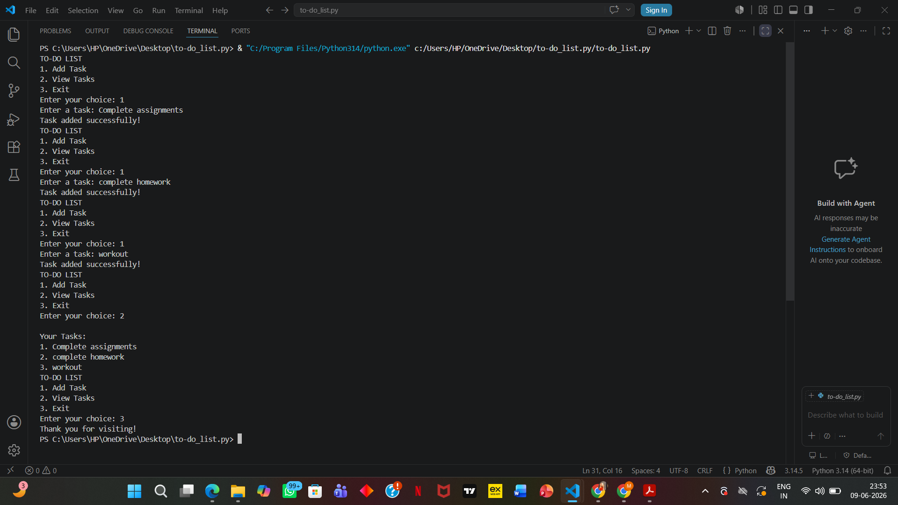

# python-todo-list
Menu-driven To-Do List application built in Python to add and manage tasks using lists and loops.

## Features
- Add tasks
- View tasks
- User-friendly menu

## Concepts Used
- Python Lists
- append()
- for loops
- while loops
- Conditional Statements

## Output

